# Part One：
This README provides step-by-step instructions for setting up and testing an Azure Function with Queue Storage output binding using Python.

---

### 🔗 [**Watch my demo on YouTube**](https://www.youtube.com/watch?v=gl1gW6ZjqhY)

## ✅ Prerequisites

- **Azure Subscription**: Active account with a Function App and associated Storage Account.
- **Visual Studio Code**: With **Azure Functions** and **Azure Storage** extensions installed.
- **Azure Storage Explorer**: For inspecting queue messages (Windows, macOS, Linux).
- **Azure Functions Core Tools**: For local development and deployment.
- **Python Environment**: Configured for Python-based functions.
- **Existing Function App**: Already created in Azure with a storage account (e.g., from a prior lab).

---

## 🛠️ Steps

### 1. Set Up Local Environment

- Install **Azure Functions** and **Azure Storage** extensions in VS Code.


### 2. Download Function App Settings

- Open VS Code, press `F1`, and run `Azure Functions: Download Remote Settings`.
- Select my Function App (e.g., `8917lab1`).
- Choose **Yes** to overwrite `local.settings.json` with Azure settings.
- **Note** the `AzureWebJobsStorage` value — used for queue binding.

### 3. Enable Binding Extensions

Ensure `host.json` includes the extension bundle setting:
```json
{
  "version": "2.0",
  "extensionBundle": {
    "id": "Microsoft.Azure.Functions.ExtensionBundle",
    "version": "[3.*, 4.0.0)"
  }
}
```

This ensures Storage binding extensions are automatically included.

### 4. Add Queue Output Binding

In function code (e.g., `HttpExample/function_app.py`), define the output binding:
```python
@app.route(route="HttpExample")
@app.queue_output(arg_name="msg", queue_name="outqueue", connection="AzureWebJobsStorage")
def HttpExample(req: func.HttpRequest, msg: func.Out[func.QueueMessage]) -> func.HttpResponse:
    logging.info('Python HTTP trigger function processed a request.')
    name = req.params.get('name')
    if not name:
        try:
            req_body = req.get_json()
        except ValueError:
            pass
        else:
            name = req_body.get('name')
    if name:
        msg.set(name)  # Write name to queue
        return func.HttpResponse(f"Hello, {name}. This HTTP triggered function executed successfully.")
    else:
        return func.HttpResponse(
            "Pass a name in the query string or request body.",
            status_code=200
        )
```

This sends the received `name` parameter to an Azure Storage queue named `outqueue`.

### 5. Run Locally

- Press `F5` in VS Code to start the function.
- Right-click `HttpExample` in the **Azure: Functions** panel → **Execute Function Now** → enter:
```json
{"name": "Azure"}
```
- The function should respond: `"Hello, Azure..."`

### 6. Verify Queue Output

- Open **Azure Storage Explorer** →  storage account → **Queues** → `outqueue`.
- Check for new messages matching the `name` value.
- Re-run the function to verify multiple messages appear.

### 7. Redeploy to Azure

- In VS Code: `F1` → `Azure Functions: Deploy to function app` → select `8917lab1`.
- Confirm that deployment will overwrite existing files.

### 8. Test the Deployed Function

Use `curl` to test the deployed endpoint:
```bash
curl -X POST https://8917lab1.azurewebsites.net/api/httpexample \
  -H "Content-Type: application/json" \
  -d '{"name": "Azure"}'
```

- Check `outqueue` in **Storage Explorer** again for the new message.

# Part two：

 🔗 Connect Azure Functions to Azure SQL Database (Python)

This guide summarizes how to connect an Azure Function to an Azure SQL Database using **Visual Studio Code** and Python. It demonstrates how to configure output bindings that write HTTP request data to a SQL table.

---

## ✅ Prerequisites

- Complete the quickstart: *Create a Python function in Azure using VS Code*.
- Azure subscription with an existing **Function App**.
- **Azure SQL Database** (serverless or sample).
- **Visual Studio Code** with:
  - Azure Functions extension
  - Azure Storage extension
- **Azure Functions Core Tools**
- **Azure SQL Connection String** (ADO.NET format)

---

## 🧱 Setup Overview

### 1. Create Azure SQL Database

- Use the [SQL quickstart](https://learn.microsoft.com/en-us/azure/azure-sql/database/single-database-create-quickstart) to provision a SQL database.
- Use **SQL Server authentication** (admin: `azureuser`).
- Enable **Allow Azure services to access server**.
- Save the **ADO.NET connection string**.

### 2. Create `dbo.ToDo` Table

Use **Query Editor** to run:
```sql
CREATE TABLE dbo.ToDo (
    [Id] UNIQUEIDENTIFIER PRIMARY KEY,
    [order] INT NULL,
    [title] NVARCHAR(200) NOT NULL,
    [url] NVARCHAR(200) NOT NULL,
    [completed] BIT NOT NULL
);
```

---

## 🔧 Configure Function App Settings

1. **Add SQL Connection String**  
   - In VS Code: `Cmd/Ctrl + Shift + P` → `Azure Functions: Add New Setting`
   - Key: `SqlConnectionString`  
   - Value: updated ADO.NET string with your password

2. **Download Settings**  
   - `Cmd/Ctrl + Shift + P` → `Azure Functions: Download Remote Settings`  
   - Select your function app  
   - Accept all prompts to overwrite `local.settings.json`

---

## ⚙️ Enable Binding Extensions

Ensure your `host.json` includes:
```json
"extensionBundle": {
  "id": "Microsoft.Azure.Functions.ExtensionBundle",
  "version": "[4.*, 5.0.0)"
}
```

---

## 🧩 Add Output Binding to Code

In `function_app.py`, use:

```python
@app.generic_output_binding(
    arg_name="toDoItems",
    type="sql",
    CommandText="dbo.ToDo",
    ConnectionStringSetting="SqlConnectionString",
    data_type=DataType.STRING
)
```

### Full Function Sample:

```python
import azure.functions as func
import logging
from azure.functions.decorators.core import DataType
import uuid

app = func.FunctionApp()

@app.function_name(name="HttpTrigger1")
@app.route(route="hello", auth_level=func.AuthLevel.ANONYMOUS)
@app.generic_output_binding(arg_name="toDoItems", type="sql", CommandText="dbo.ToDo", ConnectionStringSetting="SqlConnectionString", data_type=DataType.STRING)
def test_function(req: func.HttpRequest, toDoItems: func.Out[func.SqlRow]) -> func.HttpResponse:
     logging.info('Python HTTP trigger function processed a request.')
     name = req.get_json().get('name')
     if name:
        toDoItems.set(func.SqlRow({
            "Id": str(uuid.uuid4()), "title": name, "completed": False, "url": ""
        }))
        return func.HttpResponse(f"Hello {name}!")
     return func.HttpResponse("Please pass a name in the request body.", status_code=400)
```

---

## ▶️ Run and Test

- Press `F5` to start local Azure Function
- In the **Functions Panel**, right-click `HttpExample` → **Execute Function Now**
- Input:
```json
{ "name": "Azure" }
```

---

## 🗃️ Verify Database Output

- Go to Azure SQL Portal → your DB → Query Editor
- Run:
```sql
SELECT TOP 10 * FROM dbo.ToDo;
or
SELECT TOP 10 * FROM dbo.ToDo ORDER BY Id DESC;

```
- Confirm your name was inserted via output binding.

---

## 🚀 Redeploy to Azure

- `F1` → `Azure Functions: Deploy to function app`
- Select existing function app
- Confirm overwrite prompt
- Trigger deployed function via portal or `Execute Function Now`

## All pics here
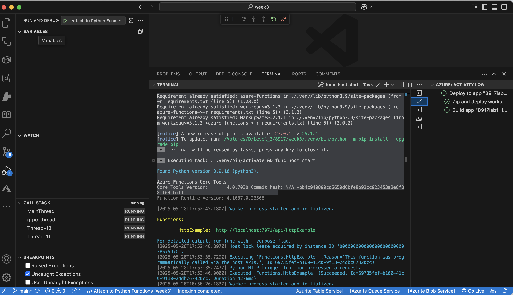
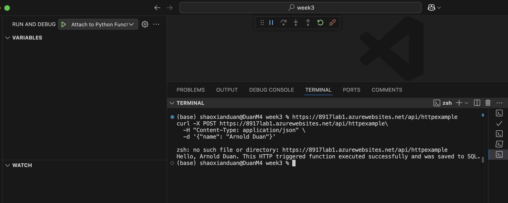
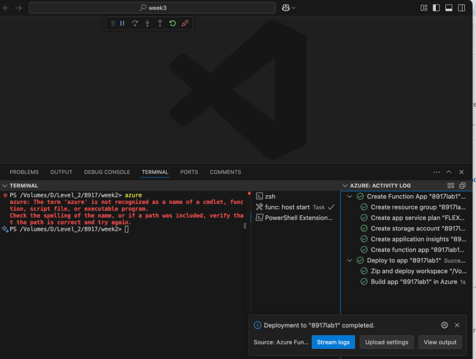
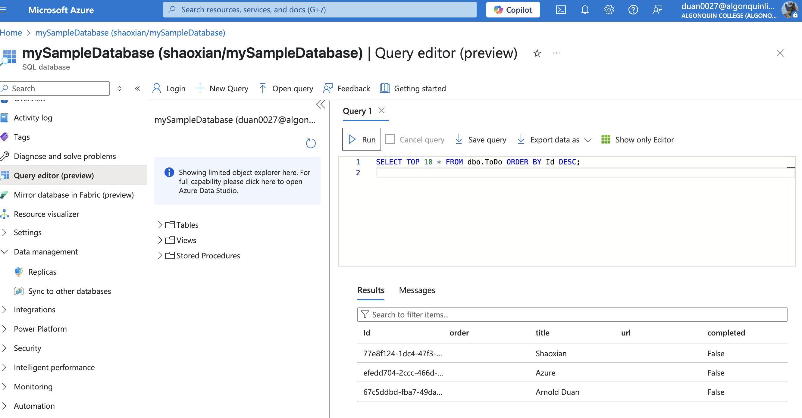
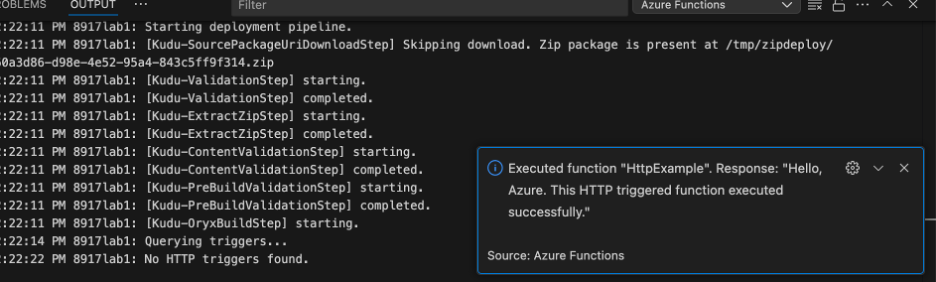
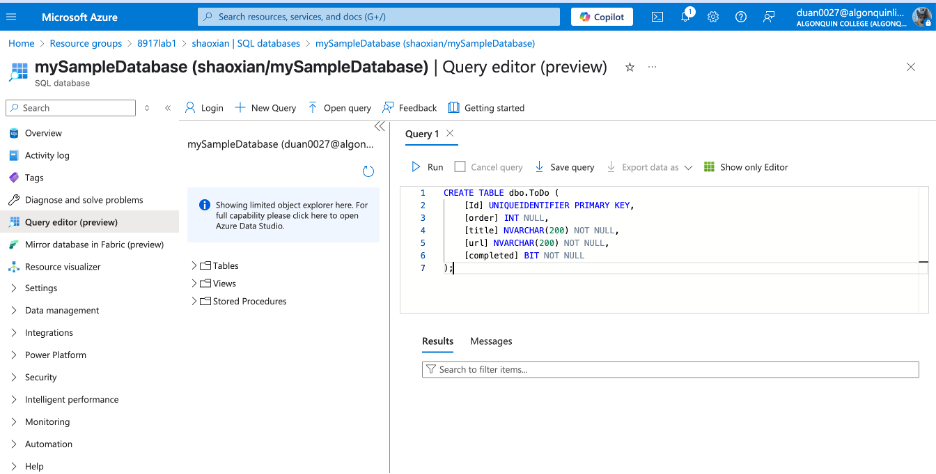
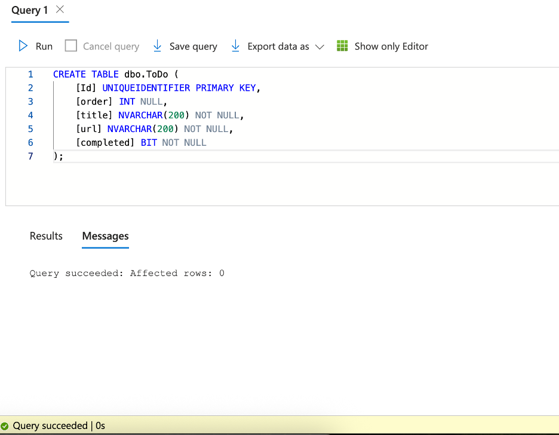
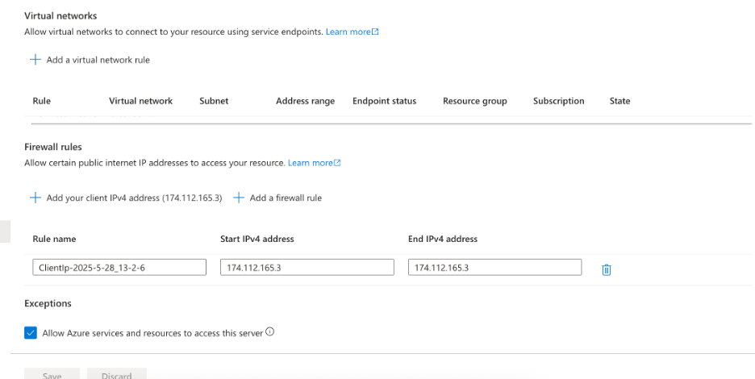
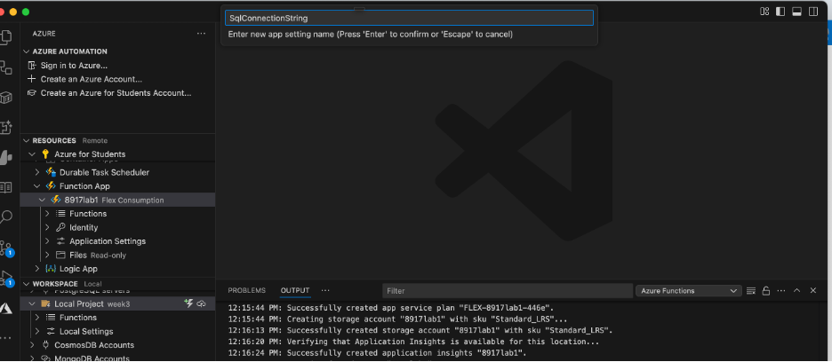
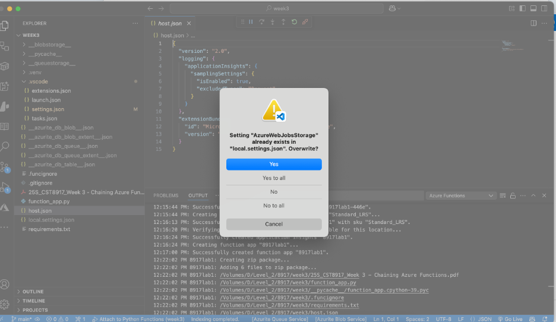
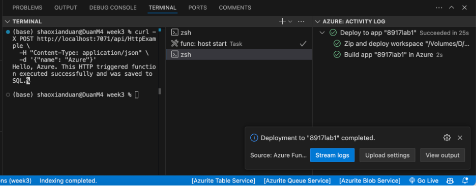
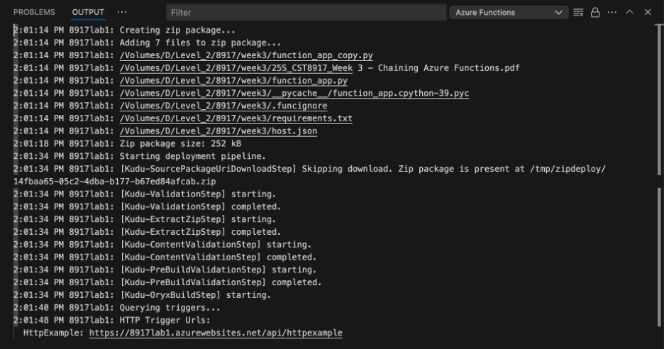